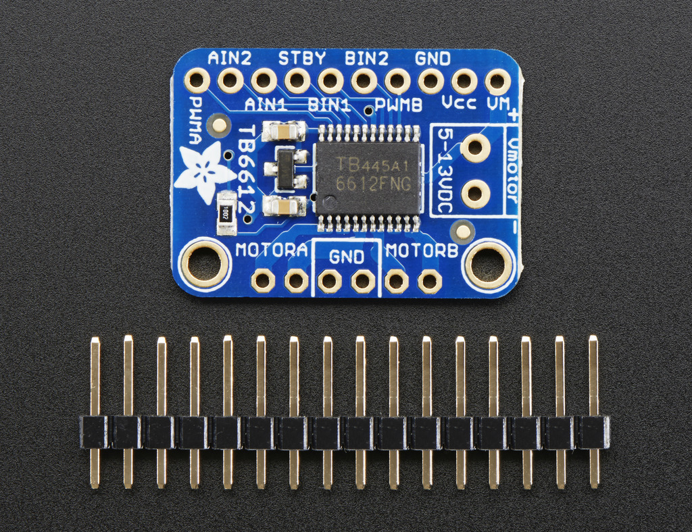

# TB6612 Hook-up Guide

This wiring and programming guide is based on
[Adafruit's tutorial](https://learn.adafruit.com/adafruit-tb6612-h-bridge-dc-stepper-motor-driver-breakout)
and
Sparkfun's [TB6612FNG Hookup Guide](https://learn.sparkfun.com/tutorials/tb6612fng-hookup-guide).

Here is a photo of the TB6612 breakout board sold by Adafruit

## Pinouts

Rather than use the bare TB6612 chip, I recommend the breakout boards from
either Adafruit, Sparkfun or Pololu.  The breakboard boards provide solder
pads on standard 0.1 inch pitch.  The pads can be soldered to male headers
that fit into standard breadboards.  Or you can solder hook-up wires directly
to the breakout board.

There are three types of pins on the Adafruit breakout board: power input pins,
signal logic pins, and motor output pins.  The following documentation is from
the
[Adafruit tutorial](https://learn.adafruit.com/adafruit-tb6612-h-bridge-dc-stepper-motor-driver-breakout).

### Power Pins

The `Vmotor` and `GND` pins provide electrical power that the TB6612 chip
passes on to the one or two motors attached via the *motor output pins* (see below).
The `Vcc` is a 3.3V to 5V supply, referenced to the `GND` pin, that powers
the logic circuits in the TB6612 chip.

`Vmotor` line supplies the current
to the motors.  The `Vcc` line uses a relatively small amount of current.

From the Adafruit tutorial:

> * **Vmotor** - This is the voltage for the motors, not for the logic level.
>   Keep this voltage between 4.5V and 13.5V. This power supply will get noisy
>   so if you have a system with analog readings or RF other noise-sensitive
>   parts, you may need to keep the power supplies seperate (or filtered!)
> 
> * **Vcc** - this is the voltage for the logic levels. Set to the voltage logic
>   you'll be using on your microcontroller. E.g. for Arduinos, 5V is probably
>   what you want. Can be 2.7V to 5.5V so good for 3V or 5V logic
> 
> * **GND** - This is the shared logic and motor ground. All grounds are connected

### Signal Logic Pins

The Signal Logic Pins are `Vcc` level (i.e. 3.3V or 5V) voltage signals that
control how the TB6612 sends power to the two motors.

From the Adafruit tutorial:
> * **AIN1**, **AIN2** - these are the two inputs to the Motor A H-bridges
> * **PWMA** - this is the PWM input for the Motor A H-bridges, if you
>   don't need PWM control, connect this to logic high.
> * **BIN1**, **BIN2** - these are the two inputs to the Motor B H-bridges
> * **PWMB** - this is the PWM input for the Motor B H-bridges, if you
>   don't need PWM control, connect this to logic high.
> * **STBY** - this is the standby pin for quickly disabling both motors,
>   pulled up to Vcc thru a 10K resistor. Connect to ground to disable.

### Motor Out Pins

These are power outputs that should be compatible with the voltage requirements
of the motor.  The level of `Vmotor` from the external supply will set the maximum
voltage supplied to the motors.  PWM is used to control the effective power/voltage
to the motors.

* **MOTORA** - these are the two outputs for motor A, controlled by `AIN1`, `AIN2` and `PWMA`
* **MOTORB** - these are the two outputs for motor B, controlled by `BIN1`, `BIN2` and `PWMB`

# Logic Signals to Control Brushed DC Motors

Refer to the
[TB6612FNG Hookup Guide](https://learn.sparkfun.com/tutorials/tb6612fng-hookup-guide)
by Sparkfun, and the
[TB6612FNG datasheet](http://www.alldatasheet.com/datasheet-pdf/pdf/807693/TOSHIBA/TB6612FNG.html).

Here is the logic control table from the datasheet:

