# OpenSwarm Documentation: Getting Started

This guide is directed at the first-time user building their own OpenSwarm research environment; see the following links for more technically-detailed [hardware](03-Hardware.md) and [software](04-Software.md) specifications.

## Testbed Setup

#### Time: <1 hour
#### Cost: $50

### Bill of Materials

The following materials will be needed to configure the OpenSwarm testbed:

| Item                                                                                                                                                                                                                                                                                                                                                                                                    | Quantity | Price |
| ------------------------------------------------------------------------------------------------------------------------------------------------------------------------------------------------------------------------------------------------------------------------------------------------------------------------------------------------------------------------------------------------------- | -------- | ----- |
| [Generic Webcam (resolution ≥ 1024x768)](https://www.amazon.com/LARMTEK-Webcam-Computer-Conference-Calling/dp/B07P84DN2K/ref=sxin_2_ac_d_pm?ac_md=2-0-VW5kZXIgJDUw-ac_d_pm&keywords=webcam+1080p&pd_rd_i=B07P84DN2K&pd_rd_r=7355076c-f61d-4db2-a713-7bf372be113c&pd_rd_w=3ffow&pd_rd_wg=xa1kL&pf_rd_p=eeff02d5-070a-45ea-a79e-d591974b877e&pf_rd_r=BVP14A6HNQECBXCC8MRB&psc=1&qid=1568577545&s=gateway) | 1        | \$30  |
| [Generic Router](https://www.amazon.com/TP-Link-N450-Wi-Fi-Router-TL-WR940N/dp/B001FWYGJS/ref=sr_1_5?keywords=router&qid=1568577613&s=gateway&sr=8-5&th=1)                                                                                                                                                                                                                                              | 1        | \$20  |
| Control Computer [(Intel/AMD x86/x64, 4GB RAM)](https://www.mathworks.com/support/requirements/matlab-system-requirements.html) | 1 | -
| Open Floor Space (25-100 ft2) with Overhead Mount for Webcam                                                                                                                                                                                                                                                                                                                                 | 1        | -     |
| **Total**                                                                                                                                                                                                                                                                                                                                                                                               |          | \$50  |

### Directions 

#### 1. Choose a location
One must first designate an area in which to construct a physical testbed. Any flat, indoor space of size 25-100ft2 will work, provided that a webcam may be mounted on the ceiling or suspended above the space in some other manner. Marking the perimeter of this space with masking tape is not necessary, but is recommended to form a frame of reference later on.

#### 2. Configure webcam
Once a location for the physical testbed has been chosen, a generic USB webcam of resolution ≥ 1024x768 must be mounted facing downwards directly above the center of the field. This will enable the OpenSwarm server software to visually track robots as they move about the field and monitor the position of each robot in discrete-time iterations.

#### 3. Configure router
Next, a generic router must be configured within range of the testbed to enable local communications across a wireless network; note that an internet connection is not necessary. The router will support UDP communication between the OpenSwarm server and each client robot.

#### 4. Source computer
Finally, a [computer capable of running Matlab](https://www.mathworks.com/support/requirements/matlab-system-requirements.html), connecting to the local network, and receiving video input from the mounted webcam will be needed; chances are that the PC you're reading this on will work just fine for such tasks.

At this stage, your testbed should reflect the conceptual diagram included below (computer not pictured).

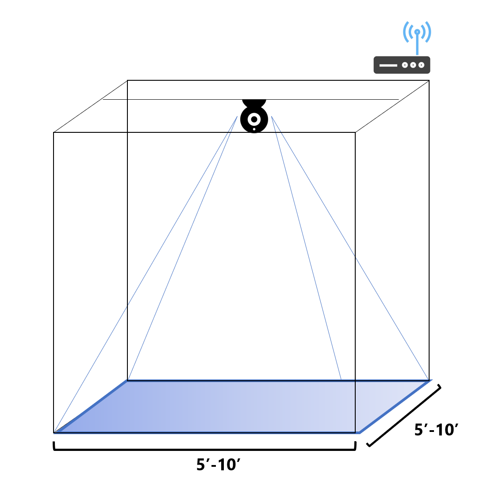

The testbed and overhead webcam used to develop the OpenSwarm project are shown below for example; however, note that only one webcam is necessary to support visual robot tracking (the second is used for auxiliary video recording).

Next, it's time to construct the swarm itself: the robots.

## Robot Setup

#### Time: 2-4 hours / robot
#### Cost: $80 / robot

### Bill of Materials

The following materials (in addition to wire cutters/strippers, screwdrivers, a soldering iron, and other standard electronics tools) will be needed to construct **one** OpenSwarm robot:

| Item                                                                                                                                                                                                                                                                                                                                                                                                                                                                                      | Quantity | Price   |
| ----------------------------------------------------------------------------------------------------------------------------------------------------------------------------------------------------------------------------------------------------------------------------------------------------------------------------------------------------------------------------------------------------------------------------------------------------------------------------------------- | -------- | ------- |
| [Arduino UNO R3](https://www.amazon.com/ELEGOO-Board-ATmega328P-ATMEGA16U2-Compliant/dp/B01EWOE0UU/ref=sxin_2_ac_d_pm?ac_md=1-0-VW5kZXIgJDE1-ac_d_pm&keywords=arduino+uno+r3&pd_rd_i=B01EWOE0UU&pd_rd_r=22f3384e-c723-40f3-ba7a-1c770d5fab06&pd_rd_w=dulQq&pd_rd_wg=N1xL5&pf_rd_p=eeff02d5-070a-45ea-a79e-d591974b877e&pf_rd_r=W66G33WKC0CQ50PF7794&psc=1&qid=1568574691&s=gateway)                                                                                                       | 1        | \$12    |
| [ESP8266](https://www.amazon.com/KeeYees-Internet-Development-Wireless-Compatible/dp/B07PR9T5R5/ref=sr_1_3?keywords=esp8266&qid=1568574741&s=gateway&sr=8-3&th=1)                                                                                                                                                                                                                                                                                                                         | 1        | \$7     |
| [Adafruit TB6612](https://www.amazon.com/Adafruit-TB6612-Stepper-Driver-Breakout/dp/B00VY32VU4/ref=sr_1_1_sspa?crid=3FCNQ4I03GN8F&keywords=adafruit+tb6612&qid=1568575347&s=gateway&sprefix=adafruit+tb%2Caps%2C140&sr=8-1-spons&psc=1&smid=A19MRELPGC5OXX&spLa=ZW5jcnlwdGVkUXVhbGlmaWVyPUEzVDhXNVhYWVNOOTNKJmVuY3J5cHRlZElkPUEwOTgxNTg5TEE1M0NaMzBTMVEyJmVuY3J5cHRlZEFkSWQ9QTA4MTA1MjUxRVFGT0REMkdPNDVKJndpZGdldE5hbWU9c3BfYXRmJmFjdGlvbj1jbGlja1JlZGlyZWN0JmRvTm90TG9nQ2xpY2s9dHJ1ZQ==) | 1        | \$5     |
| [Adafruit 3-Layer Round Robot Chassis 2WD with DC Motors](https://www.adafruit.com/product/3244?gclid=CjwKCAjwwvfrBRBIEiwA2nFiPdCmxLozNnYqI7awL7QyuuEY0aN3Qwq4G5LhX_AHaWjidQCgVE5sHBoC9r8QAvD_BwE)                                                                                                                                                                                                                                                                                        | 1        | \$30    |
| [Assorted Jumper Cables](https://www.amazon.com/ELEGOO-Solderless-Flexible-Breadboard-Arduino/dp/B01EV47GI4/ref=sr_1_1_sspa?keywords=jumper+cables+arduino&qid=1568576114&s=gateway&sr=8-1-spons&psc=1&spLa=ZW5jcnlwdGVkUXVhbGlmaWVyPUEyQUswT1A0REpGN0pTJmVuY3J5cHRlZElkPUEwNTg1ODg4UjU0OEdWMTgxUTkwJmVuY3J5cHRlZEFkSWQ9QTA3MzM1OTczU0JLRVZaMjlVMFlQJndpZGdldE5hbWU9c3BfYXRmJmFjdGlvbj1jbGlja1JlZGlyZWN0JmRvTm90TG9nQ2xpY2s9dHJ1ZQ==)                                                     | 1        | \$8     |
| [Generic 9v Battery](https://www.amazon.com/AmazonBasics-Everyday-Alkaline-Batteries-8-Pack/dp/B00MH4QM1S/ref=sr_1_4?keywords=9v+battery&qid=1568576233&s=gateway&sr=8-4)                                                                                                                                                                                                                                                                                                                 | 2        | \$1     |
| [Generic 400-pin Breadboard](https://www.amazon.com/Breadboard-Solderless-Prototype-PCB-Board/dp/B077DN2PS1/ref=sr_1_9?keywords=breadboard&qid=1569272882&sr=8-9) | 2 | \$5 |
| [Generic 9v Battery Hookup](https://www.amazon.com/Battery-Connector-Leather-Housing-Connection/dp/B06X8YZJ64/ref=sr_1_3?keywords=9v+battery+connector&qid=1568576174&s=gateway&sr=8-3)                                                                                                                                                                                                                                                                                                   | 2        | \$0.50  |
| [Generic 4-Pin Terminal](https://www.amazon.com/Antrader-5-08mm-4P-Pluggable-Terminal-Connector/dp/B07B9R5BQH/ref=pd_sbs_328_3/146-3305723-6356429?_encoding=UTF8&pd_rd_i=B07B9R5BQH&pd_rd_r=709fe889-6ec7-4a17-b2ae-152edeeee3e8&pd_rd_w=inD3m&pd_rd_wg=mNwxq&pf_rd_p=d66372fe-68a6-48a3-90ec-41d7f64212be&pf_rd_r=BJ5F4ZKPWEHRZ3NMZVCV&psc=1&refRID=BJ5F4ZKPWEHRZ3NMZVCV)                                                                                                               | 1        | \$0.50  |
| [Generic 7805 Voltage Regulator](https://www.amazon.com/Voltage-Regulator-Linear-L7805CV-Positive/dp/B07H9M9SFM/ref=sr_1_9?crid=3KEOGBUW83ZVA&keywords=5v+voltage+regulator&qid=1568576610&s=electronics&sprefix=5v+voltage%2Celectronics%2C140&sr=1-9)                                                                                                                                                                                                                                   | 1        | \$0.50  |
| [Generic 0.1uF Capacitor](https://www.amazon.com/Projects-B-0002-C11-Ceramic-Capacitor-0-1uF/dp/B00E6PNOXU/ref=sr_1_2_sspa?crid=1W1UFEZHPTHE2&keywords=0.1+uf+capacitor&qid=1568576699&s=industrial&sprefix=0.1+uf%2Celectronics%2C142&sr=1-2-spons&psc=1&spLa=ZW5jcnlwdGVkUXVhbGlmaWVyPUFQSThBUjlESUFPNVUmZW5jcnlwdGVkSWQ9QTAzOTA1MjMzSkNIU0NQMVFKVEk3JmVuY3J5cHRlZEFkSWQ9QTAwNzc3OTMzTldDOTRBMzUyVDNPJndpZGdldE5hbWU9c3BfYXRmJmFjdGlvbj1jbGlja1JlZGlyZWN0JmRvTm90TG9nQ2xpY2s9dHJ1ZQ==)  | 1        | \$0.50  |
| [Generic 6-Pin Switch](https://www.amazon.com/Position-Vertical-Switch-Electronics-Project/dp/B07F7PNDGM/ref=sr_1_10?keywords=breadboard+switch&qid=1568575553&s=gateway&sr=8-10)                                                                                                                                                                                                                                                                                                         | 2        | \$0.50  |
| [Generic LED](https://www.amazon.com/Lights-Emitting-Assortment-Arduino-300-Pack/dp/B00UWBJM0Q/ref=sr_1_5?keywords=circuit+led&qid=1568575708&s=gateway&sr=8-5)                                                                                                                                                                                                                                                                                                                           | 5        | \$0.50  |
| [Generic Potentiometer](https://www.amazon.com/Trimpot-Variable-Resistor-Potentiometer-Assortment/dp/B071WW6VN8/ref=sr_1_1_sspa?crid=1NV1IES4CDEA9&keywords=potentiometer&qid=1568575769&s=gateway&sprefix=potentiometer%2Caps%2C140&sr=8-1-spons&psc=1&spLa=ZW5jcnlwdGVkUXVhbGlmaWVyPUEzRDE5OEVHOTJKTUg3JmVuY3J5cHRlZElkPUExMDM3NzAwMTNZRUJIU09RQlEzNiZlbmNyeXB0ZWRBZElkPUEwMzg5MTQ2UEtNVDcwTEdWSFVSJndpZGdldE5hbWU9c3BfYXRmJmFjdGlvbj1jbGlja1JlZGlyZWN0JmRvTm90TG9nQ2xpY2s9dHJ1ZQ==)    | 1        | \$0.50  |
| [Generic 220Ω Resistor](https://www.amazon.com/AUSTOR-Resistors-Assortment-Resistor-Experiments/dp/B07BKRS4QZ/ref=sr_1_3?keywords=resistors&qid=1568575864&s=gateway&sr=8-3)                                                                                                                                                                                                                                                                                                              | 5        | \$0.50  |
| [Generic 400-pin Breadboard](https://www.amazon.com/Breadboard-Solderless-Prototype-PCB-Board/dp/B077DN2PS1/ref=sr_1_9?keywords=breadboard&qid=1569272882&sr=8-9) | 2 | \$5 |
| [(Optional) Generic Photoresistor](https://www.amazon.com/MCIGICM-Photoresistor-Sensitive-Resistor-Dependent/dp/B07PF3CWW9/ref=sr_1_7?keywords=photoresistor&qid=1568575900&s=gateway&sr=8-7)                                                                                                                                                                                                                                                                                             | 1        | \$0.50  |
| [(Optional) 3D Printed Casing]()                                                                                                                                                                                                                                                                                                                                                                                                                                                          | 1        | \$2     |
| **Total**                                                                                                                                                                                                                                                                                                                                                                                                                                                                                 |          | \$79.50 |

### Directions

#### 1. Set up workspace

Prior to assembling the OpenSwarm robot, designate a workspace for construction. Gather wire cutters/strippers, screwdrivers, a soldering iron, and other standard electronics tools which will be utilized. Remove any flammable or fragile objects from the workspace. 

#### 2. Assemble robot chassis

Assemble the [Adafruit 3-Layer Round Robot Chassis 2WD with DC Motors](https://www.adafruit.com/product/3244?gclid=CjwKCAjwwvfrBRBIEiwA2nFiPdCmxLozNnYqI7awL7QyuuEY0aN3Qwq4G5LhX_AHaWjidQCgVE5sHBoC9r8QAvD_BwE) following the directions [here](https://learn.adafruit.com/tri-layer-mini-round-robot-chassis-kit?view=all).

Leave the top plate of the chassis detached for now. You should have a chassis with 2 DC motors and 2 wheels as pictured below:

#### 3. Flash ESP firmware

Following the instructions in the [ESP/Readme.pdf](../ESP/Readme.pdf), run the [ESP Flash Tool](../ESP/ESPFlashDownloadTool_v3.6.4.exe) and select the `ESP8266 DownloadTool` from the main menu. Connect to the ESP8266 with an FTDI adapter and flash the following settings from the [ESP8266_NONOS_SDK-2.2.1](../ESP/ESP8266_NONOS_SDK-2.2.1) library to enable its communication with the Arduino UNO. A more detailed tutorial involving this flashing process can be found [here](https://medium.com/@aallan/getting-started-with-the-esp8266-270e30feb4d1); a full explanation of the configuration of the ESP8266 is beyond the scope of this tutorial.

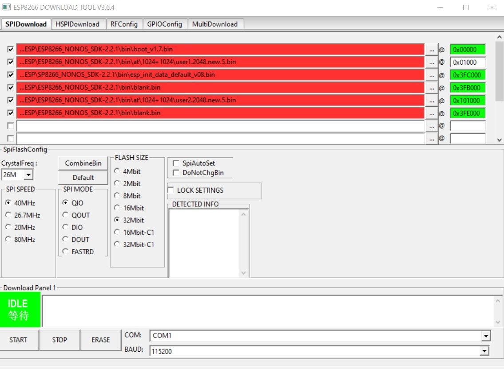

#### 4. Assemble robot circuitry

Following the [Fritzing diagram](../Hardware/Fritzing/RobotSchematic.fzz) shown below, assemble the circuitry of each robot.

#### 5. Integrate circuitry with chassis

Determine the proper alignment of the top chassis plate left detached in step 2, and mount the Arduino UNO to the bottom of this plate using Command strips or double-sided tape such that the GPIO ports of the UNO face outwards.

Mount the two breadboards and associated components to the top of the middle plate on the chassis, and "sandwich" the jumper cables connecting the UNO to the breadboards between the upwards-facing breadboard mounted on the middle plate and the downwards-facing UNO mounted on the top plate. Thread the indicator LEDs and photoresistor through the top plate so they are visible from outside the "sandwiched" chassis.

Screw the top plate of the chassis onto the supports to secure this "sandwich" of electronic components in place. Following this step, your robot should look like the one below, and should be ready for operation following software setup.

Photos from intermediate steps throughout the construction process are included below for further reference.

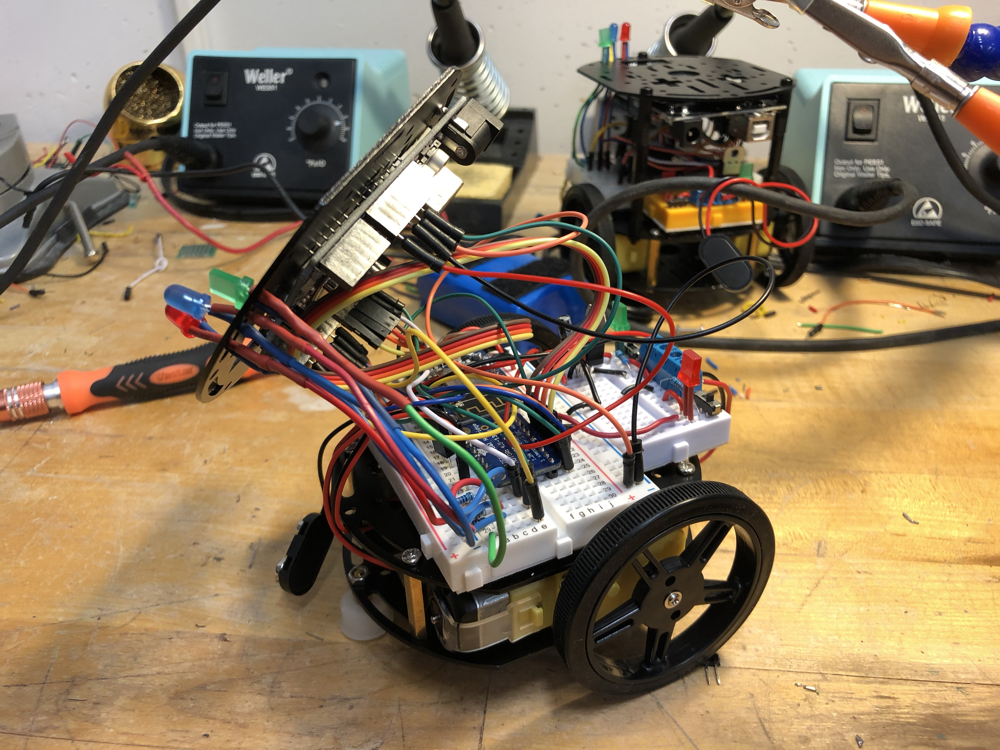
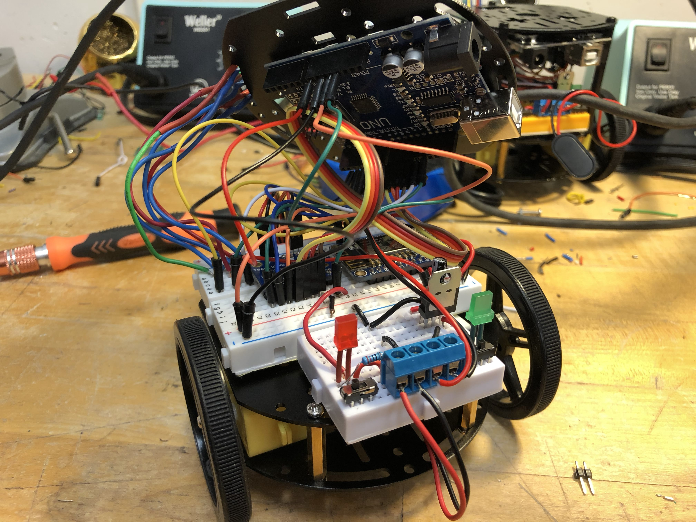
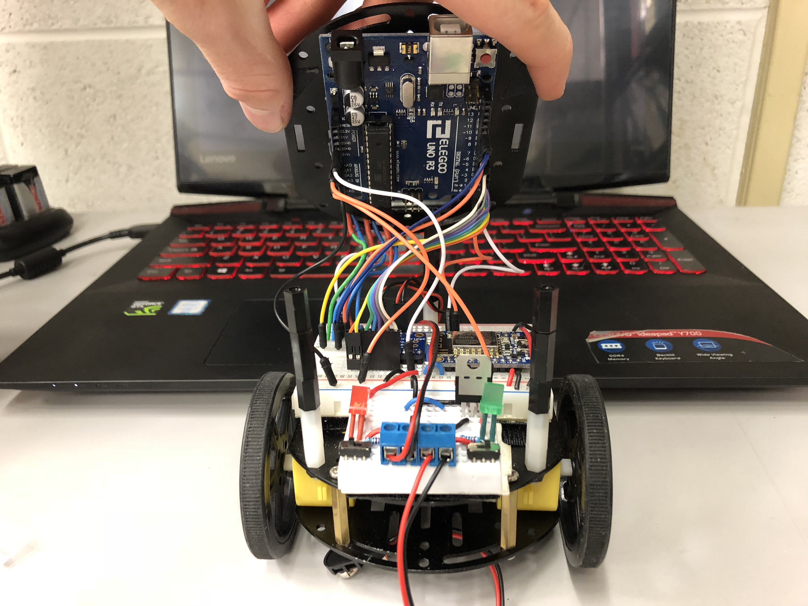
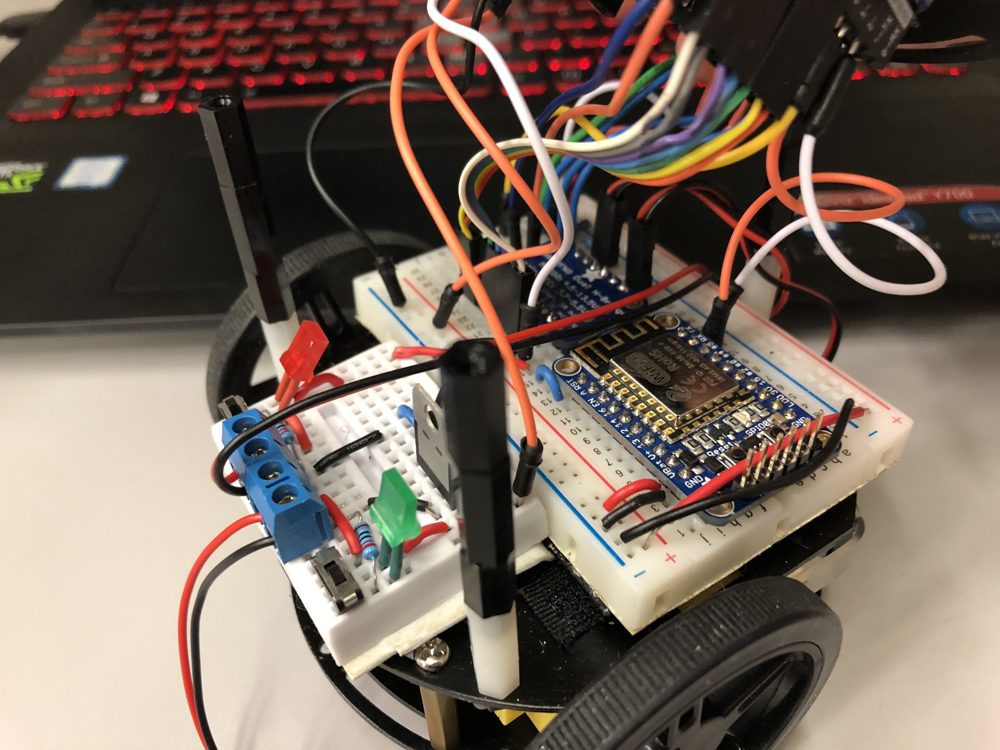
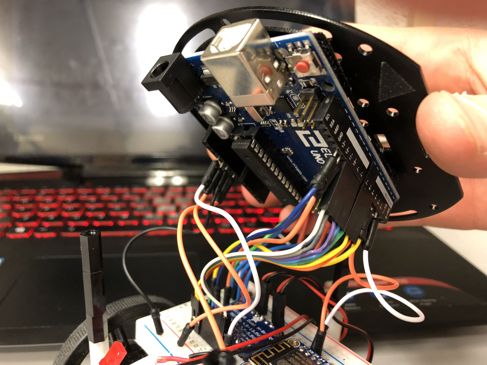
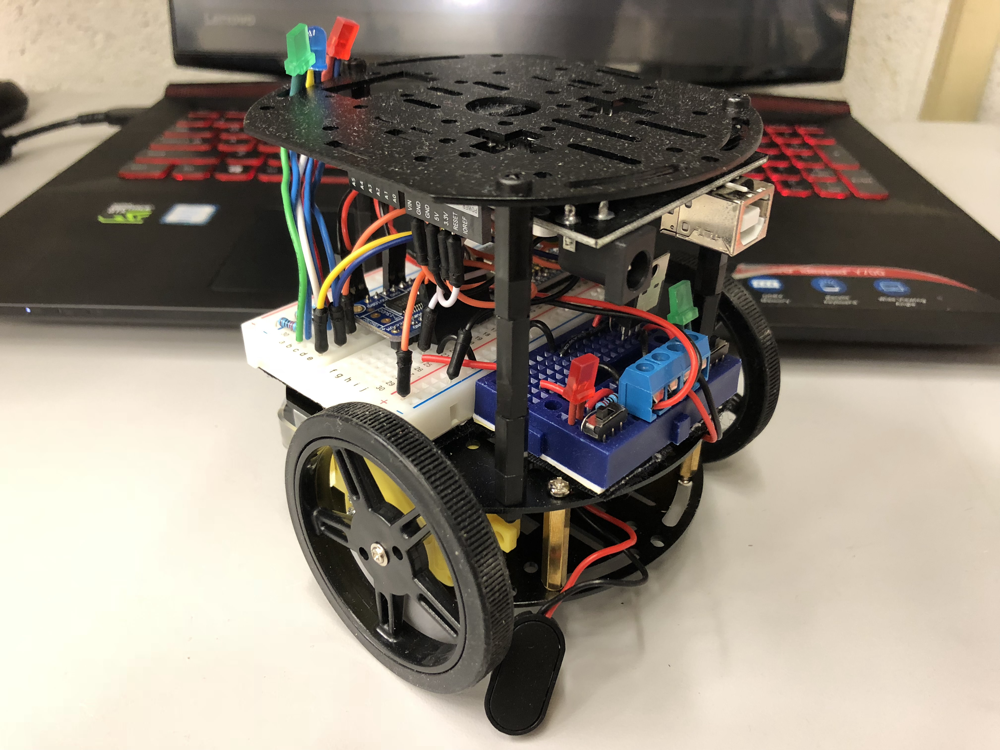
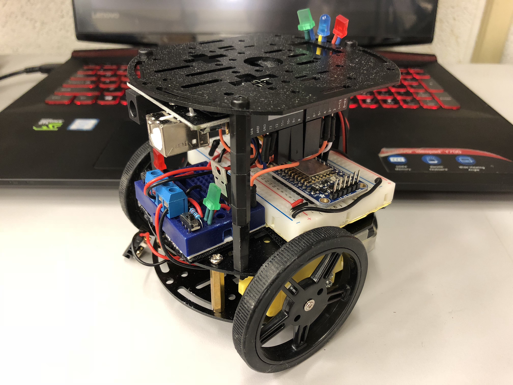

#### 6. (Optional) 3D print and mount cover

Modify the [RobotCover.ipt](../Hardware/3DModels/RobotCover.ipt) to your liking in Autodesk Inventor, then print the [RobotCover.stl](../Hardware/3DModels/RobotCover.stl) to improve the aesthetics of your robot.

#### 7. Place tracking anchors on top of robot

The OpenSwarm server software locates each robot in the testbed by identifying contiguous patches of white pixels which correspond to white visual tracking anchors mounted on each robot.

To properly integrate with this visual tracking software, each robot must have three white anchors on its top, arranged in an isoceles triangle whose base is shorter than its legs, and whose base is opposite the nose of the robot.

That is, the visual tracking anchors should be mounted atop each robot as depicted above: with one anchor near the nose of the robot, and the other two opposite the nose of the robot to form an isoceles triangle which "points" in the direction of the robot's nose.

The visual tracking anchors may be made of paper, white tape, or any bright material, so long as they contrast with the color of the robot cover and testbed floor.

Refer to the schematic below for proper anchor placement:

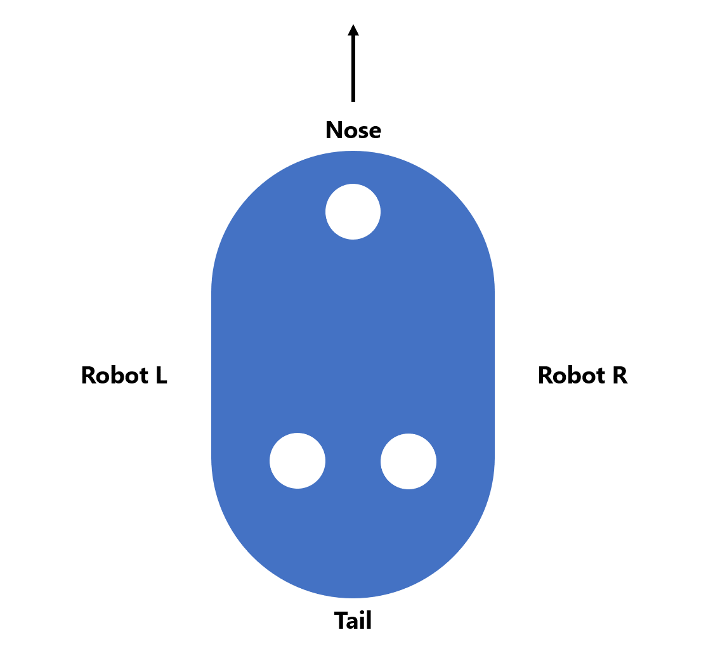

#### 8. Repeat

A set of two to three robots enables one to experiment with the most basic swarm control algorithms; a set of four or more enables one to deal with increasing complexity and correspondingly more sophisticated control algorithms.

Though the first robot of the swarm may take upwards of 4 hours to build, subsequent robots will be quicker to construct once one masters the process. An experienced researcher may be able to construct a robot in as little as two hours.

## Software Setup

#### Time: 1 hour
#### Cost: Free

### Prerequisites

Clone or download a local copy of the OpenSwarm repository for use throughout the software setup section.

Install Matlab on the designated system control computer, along with an Arduino IDE of your choice: options include the official [Arduino IDE](https://www.arduino.cc/en/main/software), or [Visual Studio Code](https://code.visualstudio.com/download) with the [Arduino Extension](https://marketplace.visualstudio.com/items?itemName=vsciot-vscode.vscode-arduino).

Download the [Matlab Image Acquisition Toolbox](https://www.mathworks.com/help/imaq/index.html?s_tid=CRUX_lftnav) and install it to enable visual tracking by the OpenSwarm server.

### Client (Robot) Setup

#### 1. Modify configuration settings

Modify the fields of the client's [`Configuration.h`](../Arduino/src/include/Configuration.h) file to align with your preferences, leaving hardware pin variable values unchanged. 

At a minimum, set the `ID` to be a unique integer value, and set the `SSID` and `Password` fields to match your local network's. No other settings _need_ be changed, but can be depending on circumstance (e.g., a network IP / port conflict).

#### 2. Upload `Pathfinder.ino` to robot

Using an Arduino IDE of your choice, connect to the the robot's UNO with a USB cable, and upload [`Pathfinder.ino`](../Arduino/src/Pathfinder.ino) to the board. This sketch enables the robot to receive and parse UDP commands transmitted by the OpenSwarm server, then turn and drive in the testbed to execute those commands.

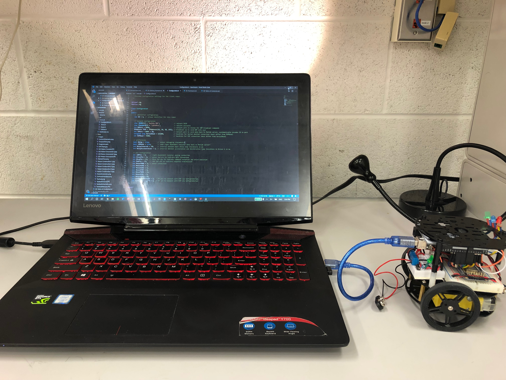

For more information on uploading Arduino sketches, see [here](https://www.arduino.cc/en/main/howto).

#### 3. Repeat

Repeat steps 1-2 for each robot in your swarm, and be sure to change the `ID` field in `Configuration.h` in step 1 to a different value for each robot. 

While not necessary, it is recommended to physically label each robot with the `ID` of its `Configuration.h` file for future reference. Consider writing the `ID` number of each robot on a piece of tape, and sticking it to the bottom of each robot.

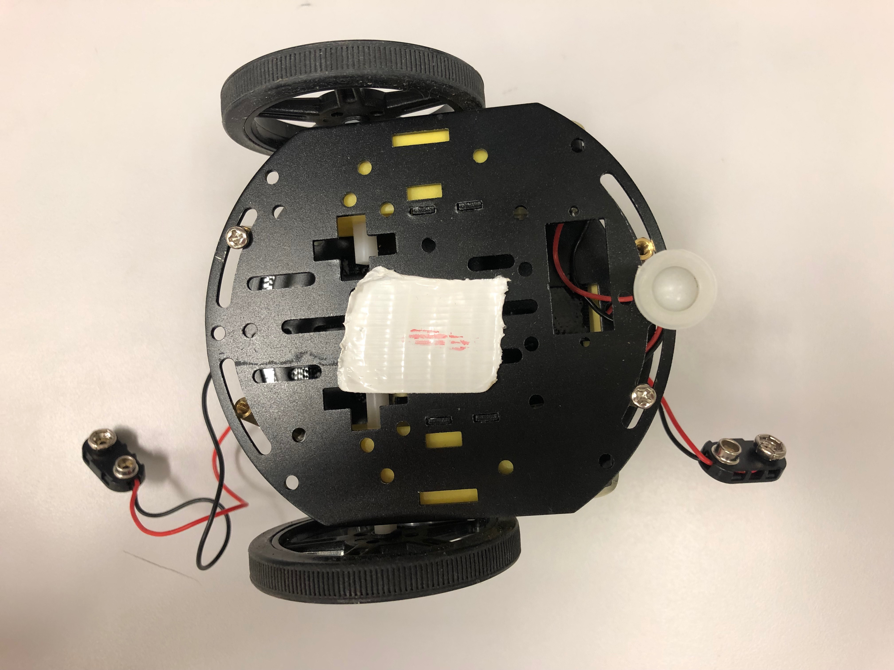

### Server Setup

#### 1. Modify configuration settings

Modify the fields of the server's [Environment.m](../Matlab/Models/Environment.m) file to align with your preferences by adjusting the values inside of the `Environment` constructor.

In particular, be sure to set the `XAxisSize` and `YAxisSize` to match the pixel dimensions of the webcam being used for tracking.

If necessary, modify the parameters of the `videoinput` call inside the `StartCamera` function of [`Vision.m`](../Matlab/Actors/Vision.m) to properly integrate with your system's webcam; if your system only has a single webcam, this setting should not need adjustment.

If necessary, modify the UDP IP and Port fields within [`Messenger.m`](../Matlab/Actors/Messenger.m); by default, however, these settings should not need adjustment.

#### 2. Debug `Test.m`

Utilize Matlab's debugging capabilities to step through [`Test.m`](../Matlab/Controllers/Test.m) and ensure the major components of the OpenSwarm server are properly functioning; step inside function calls to get a sense of how the control software operates. 

Function and class responsibilities should be evident from their names; provided docstrings and internal comments within the source code should explain the logic and role of each component. More detail regarding software architecture can be found [here](04-Software.md).

In the case of an error, review the provided stack trace, and research the problem using Matlab's `doc` command. In addition, [Matlab Answers](https://www.mathworks.com/matlabcentral/answers/index), Google, or OpenSwarm's [Troubleshooting guide](A1-Troubleshooting.md) may be of assistance. Don't hesitate to [contact us](A2-Contact.md) with questions, either!

## Next Steps

Congratulations! If you've made it this far, you're an official member of the OpenSwarm family.

See if you can recreate the included [demos](05-Demos.md) on your system, then dive into the [hardware](03-Hardware.md) and [software](04-Software.md) specifications to get a better sense of the tools OpenSwarm provides.

From here on out, OpenSwarm is what you choose to make of it!

<a href=01-Introduction.md>Previous: Introduction</a>

<a href=03-Hardware.md>Next: Hardware</a>
