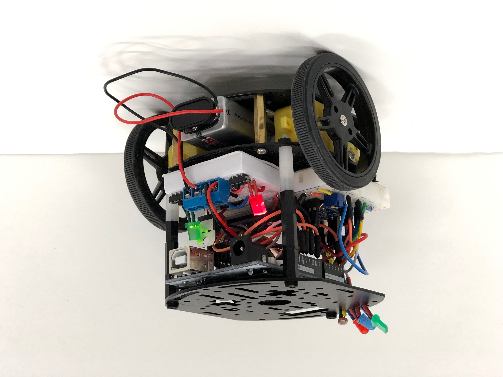
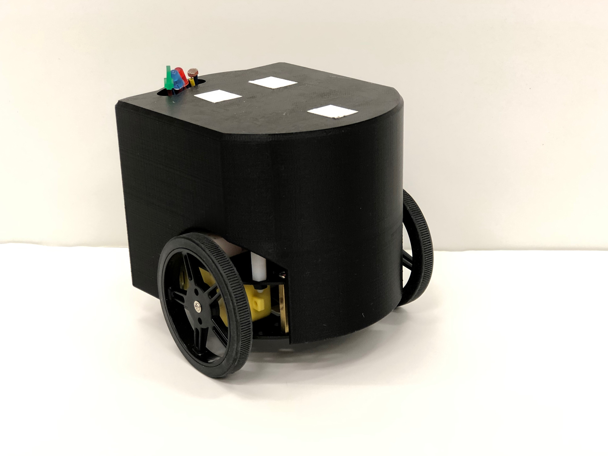
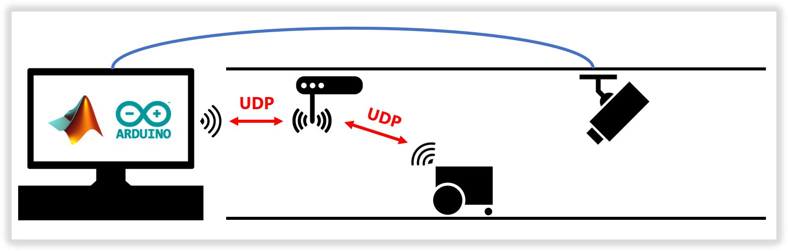

# OpenSwarm Documentation: Hardware

## Design

When designing the physical side of OpenSwarm, simplicity, flexibility, and affordability were of paramount concern. To study advanced swarm control algorithms requires an adaptable and robust physical foundation; to enable innovation in software, hardware must not get in the way.

As such, hardware design choices were kept generic and open-source; the goal was to keep attention on _what could be done_ with the system, rather than _on the system itself._ The result: an open-source, accessible, portable and hardware-agnostic swarm robotics control framework for the advancement of algorithmic research in distributed systems, multi-agent systems and human-robot interaction.

### Robot

A bi-wheeled, [Arduino](https://www.arduino.cc/)-controlled robot design was chosen for simplicity, flexibility, and affordability's sake; at under $80 per robot, a testbed and swarm of 5 robots can be constructed for under $500. Extensive documentation on the open-source Arduino project is available online along with countless open-source libraries, making the platform ideal for low-cost, high-speed development. Standardized 5V logic and jumper-cable-friendly I/O further solidifes Arduino as the gold-standard of research-oriented development.

WiFi connectivity is provided by the [ESP8266 board](https://en.wikipedia.org/wiki/ESP8266), and mobility is provided by two generic 5v DC motors under control of an [Adafruit TB6612](https://learn.adafruit.com/adafruit-tb6612-h-bridge-dc-stepper-motor-driver-breakout/overview) motor driver. Both components were again chosen on the criteria of simplicity, flexibility, and affordability.

### Testbed

To keep with the theme of simplicity, flexibility, and affordability, the testbed consists of only three parts: open floor space (25-100 ft2), an overhead webcam for visual tracking and robot localization, and a router to enable UDP communication between a central server and client robots. These three elements are all that's needed to turn a classroom, basement, or bedroom into one's own research lab.

## Architecture

### Robot

Included below is a bill of materials necessary for each robot's construction, followed by a wiring diagram and images of a finished robot. Note that the photoresistor is optional, and could be replaced by any sensor relevant to the nature of an experiment for data feedback to the central server.

| Item                                                                                                                                                                                                                                                                                                                                                                                                                                                                                      | Quantity | Price   |
| ----------------------------------------------------------------------------------------------------------------------------------------------------------------------------------------------------------------------------------------------------------------------------------------------------------------------------------------------------------------------------------------------------------------------------------------------------------------------------------------- | -------- | ------- |
| [Arduino UNO R3](https://www.amazon.com/ELEGOO-Board-ATmega328P-ATMEGA16U2-Compliant/dp/B01EWOE0UU/ref=sxin_2_ac_d_pm?ac_md=1-0-VW5kZXIgJDE1-ac_d_pm&keywords=arduino+uno+r3&pd_rd_i=B01EWOE0UU&pd_rd_r=22f3384e-c723-40f3-ba7a-1c770d5fab06&pd_rd_w=dulQq&pd_rd_wg=N1xL5&pf_rd_p=eeff02d5-070a-45ea-a79e-d591974b877e&pf_rd_r=W66G33WKC0CQ50PF7794&psc=1&qid=1568574691&s=gateway)                                                                                                       | 1        | \$12    |
| [ESP8266](https://www.amazon.com/KeeYees-Internet-Development-Wireless-Compatible/dp/B07PR9T5R5/ref=sr_1_3?keywords=esp8266&qid=1568574741&s=gateway&sr=8-3&th=1)                                                                                                                                                                                                                                                                                                                         | 1        | \$7     |
| [Adafruit TB6612](https://www.amazon.com/Adafruit-TB6612-Stepper-Driver-Breakout/dp/B00VY32VU4/ref=sr_1_1_sspa?crid=3FCNQ4I03GN8F&keywords=adafruit+tb6612&qid=1568575347&s=gateway&sprefix=adafruit+tb%2Caps%2C140&sr=8-1-spons&psc=1&smid=A19MRELPGC5OXX&spLa=ZW5jcnlwdGVkUXVhbGlmaWVyPUEzVDhXNVhYWVNOOTNKJmVuY3J5cHRlZElkPUEwOTgxNTg5TEE1M0NaMzBTMVEyJmVuY3J5cHRlZEFkSWQ9QTA4MTA1MjUxRVFGT0REMkdPNDVKJndpZGdldE5hbWU9c3BfYXRmJmFjdGlvbj1jbGlja1JlZGlyZWN0JmRvTm90TG9nQ2xpY2s9dHJ1ZQ==) | 1        | \$5     |
| [Adafruit 3-Layer Round Robot Chassis 2WD with DC Motors](https://www.adafruit.com/product/3244?gclid=CjwKCAjwwvfrBRBIEiwA2nFiPdCmxLozNnYqI7awL7QyuuEY0aN3Qwq4G5LhX_AHaWjidQCgVE5sHBoC9r8QAvD_BwE)                                                                                                                                                                                                                                                                                        | 1        | \$30    |
| [Assorted Jumper Cables](https://www.amazon.com/ELEGOO-Solderless-Flexible-Breadboard-Arduino/dp/B01EV47GI4/ref=sr_1_1_sspa?keywords=jumper+cables+arduino&qid=1568576114&s=gateway&sr=8-1-spons&psc=1&spLa=ZW5jcnlwdGVkUXVhbGlmaWVyPUEyQUswT1A0REpGN0pTJmVuY3J5cHRlZElkPUEwNTg1ODg4UjU0OEdWMTgxUTkwJmVuY3J5cHRlZEFkSWQ9QTA3MzM1OTczU0JLRVZaMjlVMFlQJndpZGdldE5hbWU9c3BfYXRmJmFjdGlvbj1jbGlja1JlZGlyZWN0JmRvTm90TG9nQ2xpY2s9dHJ1ZQ==)                                                     | 1        | \$8     |
| [Generic 9v Battery](https://www.amazon.com/AmazonBasics-Everyday-Alkaline-Batteries-8-Pack/dp/B00MH4QM1S/ref=sr_1_4?keywords=9v+battery&qid=1568576233&s=gateway&sr=8-4)                                                                                                                                                                                                                                                                                                                 | 2        | \$1     |
| [Generic 400-pin Breadboard](https://www.amazon.com/Breadboard-Solderless-Prototype-PCB-Board/dp/B077DN2PS1/ref=sr_1_9?keywords=breadboard&qid=1569272882&sr=8-9) | 2 | \$5 |
| [Generic 9v Battery Hookup](https://www.amazon.com/Battery-Connector-Leather-Housing-Connection/dp/B06X8YZJ64/ref=sr_1_3?keywords=9v+battery+connector&qid=1568576174&s=gateway&sr=8-3)                                                                                                                                                                                                                                                                                                   | 2        | \$0.50  |
| [Generic 4-Pin Terminal](https://www.amazon.com/Antrader-5-08mm-4P-Pluggable-Terminal-Connector/dp/B07B9R5BQH/ref=pd_sbs_328_3/146-3305723-6356429?_encoding=UTF8&pd_rd_i=B07B9R5BQH&pd_rd_r=709fe889-6ec7-4a17-b2ae-152edeeee3e8&pd_rd_w=inD3m&pd_rd_wg=mNwxq&pf_rd_p=d66372fe-68a6-48a3-90ec-41d7f64212be&pf_rd_r=BJ5F4ZKPWEHRZ3NMZVCV&psc=1&refRID=BJ5F4ZKPWEHRZ3NMZVCV)                                                                                                               | 1        | \$0.50  |
| [Generic 7805 Voltage Regulator](https://www.amazon.com/Voltage-Regulator-Linear-L7805CV-Positive/dp/B07H9M9SFM/ref=sr_1_9?crid=3KEOGBUW83ZVA&keywords=5v+voltage+regulator&qid=1568576610&s=electronics&sprefix=5v+voltage%2Celectronics%2C140&sr=1-9)                                                                                                                                                                                                                                   | 1        | \$0.50  |
| [Generic 0.1uF Capacitor](https://www.amazon.com/Projects-B-0002-C11-Ceramic-Capacitor-0-1uF/dp/B00E6PNOXU/ref=sr_1_2_sspa?crid=1W1UFEZHPTHE2&keywords=0.1+uf+capacitor&qid=1568576699&s=industrial&sprefix=0.1+uf%2Celectronics%2C142&sr=1-2-spons&psc=1&spLa=ZW5jcnlwdGVkUXVhbGlmaWVyPUFQSThBUjlESUFPNVUmZW5jcnlwdGVkSWQ9QTAzOTA1MjMzSkNIU0NQMVFKVEk3JmVuY3J5cHRlZEFkSWQ9QTAwNzc3OTMzTldDOTRBMzUyVDNPJndpZGdldE5hbWU9c3BfYXRmJmFjdGlvbj1jbGlja1JlZGlyZWN0JmRvTm90TG9nQ2xpY2s9dHJ1ZQ==)  | 1        | \$0.50  |
| [Generic 6-Pin Switch](https://www.amazon.com/Position-Vertical-Switch-Electronics-Project/dp/B07F7PNDGM/ref=sr_1_10?keywords=breadboard+switch&qid=1568575553&s=gateway&sr=8-10)                                                                                                                                                                                                                                                                                                         | 2        | \$0.50  |
| [Generic LED](https://www.amazon.com/Lights-Emitting-Assortment-Arduino-300-Pack/dp/B00UWBJM0Q/ref=sr_1_5?keywords=circuit+led&qid=1568575708&s=gateway&sr=8-5)                                                                                                                                                                                                                                                                                                                           | 5        | \$0.50  |
| [Generic Potentiometer](https://www.amazon.com/Trimpot-Variable-Resistor-Potentiometer-Assortment/dp/B071WW6VN8/ref=sr_1_1_sspa?crid=1NV1IES4CDEA9&keywords=potentiometer&qid=1568575769&s=gateway&sprefix=potentiometer%2Caps%2C140&sr=8-1-spons&psc=1&spLa=ZW5jcnlwdGVkUXVhbGlmaWVyPUEzRDE5OEVHOTJKTUg3JmVuY3J5cHRlZElkPUExMDM3NzAwMTNZRUJIU09RQlEzNiZlbmNyeXB0ZWRBZElkPUEwMzg5MTQ2UEtNVDcwTEdWSFVSJndpZGdldE5hbWU9c3BfYXRmJmFjdGlvbj1jbGlja1JlZGlyZWN0JmRvTm90TG9nQ2xpY2s9dHJ1ZQ==)    | 1        | \$0.50  |
| [Generic 220Ω Resistor](https://www.amazon.com/AUSTOR-Resistors-Assortment-Resistor-Experiments/dp/B07BKRS4QZ/ref=sr_1_3?keywords=resistors&qid=1568575864&s=gateway&sr=8-3)                                                                                                                                                                                                                                                                                                              | 5        | \$0.50  |
| [Generic 400-pin Breadboard](https://www.amazon.com/Breadboard-Solderless-Prototype-PCB-Board/dp/B077DN2PS1/ref=sr_1_9?keywords=breadboard&qid=1569272882&sr=8-9) | 2 | \$5 |
| [(Optional) Generic Photoresistor](https://www.amazon.com/MCIGICM-Photoresistor-Sensitive-Resistor-Dependent/dp/B07PF3CWW9/ref=sr_1_7?keywords=photoresistor&qid=1568575900&s=gateway&sr=8-7)                                                                                                                                                                                                                                                                                             | 1        | \$0.50  |
| [(Optional) 3D Printed Casing]()                                                                                                                                                                                                                                                                                                                                                                                                                                                          | 1        | \$2     |
| **Total**                                                                                                                                                                                                                                                                                                                                                                                                                                                                                 |          | \$79.50 |

The schematic below (from [this Fritzing file](../Hardware/Fritzing/RobotSchematic.fzz)) diagrams the architecture of each OpenSwarm robot:

An assembled robot with breadboards, motors, and controllers mounted to an [Adafruit 3-Layer Chassis](https://www.adafruit.com/product/3244?gclid=CjwKCAjwwvfrBRBIEiwA2nFiPdCmxLozNnYqI7awL7QyuuEY0aN3Qwq4G5LhX_AHaWjidQCgVE5sHBoC9r8QAvD_BwE):

An assembled robot complete with [3D-printed casing](../Hardware/3DModels/RobotCover.stl) and visual tracking anchors:

### Testbed

Included below is a bill of materials necessary for the testbed's construction, followed by a conceptual diagram of the testbed and images of the one used when developing OpenSwarm.

| Item                                                                                                                                                                                                                                                                                                                                                                                                    | Quantity | Price |
| ------------------------------------------------------------------------------------------------------------------------------------------------------------------------------------------------------------------------------------------------------------------------------------------------------------------------------------------------------------------------------------------------------- | -------- | ----- |
| [Generic Webcam (resolution ≥ 1024x768)](https://www.amazon.com/LARMTEK-Webcam-Computer-Conference-Calling/dp/B07P84DN2K/ref=sxin_2_ac_d_pm?ac_md=2-0-VW5kZXIgJDUw-ac_d_pm&keywords=webcam+1080p&pd_rd_i=B07P84DN2K&pd_rd_r=7355076c-f61d-4db2-a713-7bf372be113c&pd_rd_w=3ffow&pd_rd_wg=xa1kL&pf_rd_p=eeff02d5-070a-45ea-a79e-d591974b877e&pf_rd_r=BVP14A6HNQECBXCC8MRB&psc=1&qid=1568577545&s=gateway) | 1        | \$30  |
| [Generic Router](https://www.amazon.com/TP-Link-N450-Wi-Fi-Router-TL-WR940N/dp/B001FWYGJS/ref=sr_1_5?keywords=router&qid=1568577613&s=gateway&sr=8-5&th=1)                                                                                                                                                                                                                                              | 1        | \$20  |
| Open Floor Space (25-100 ft2) with Overhead Mount for Webcam                                                                                                                                                                                                                                                                                                                                 | 1        | -     |
| **Total**                                                                                                                                                                                                                                                                                                                                                                                               |          | \$50  |

A conceptual diagram of the testbed setup:

Testbed used to develop OpenSwarm (approximately 10ft x 10ft; router not pictured). Note that the dark flooring enables visual tracking of the white anchor points on each robot:

Webcams mounted above the testbed used to develop OpenSwarm; note that only one is necessary for visual tracking in Matlab (the second is for simultaneous video capture when running experiments):

<a href=02-Getting-Started.md>Previous: Getting Started</a>

<a href=04-Software.md>Next: Software</a>
