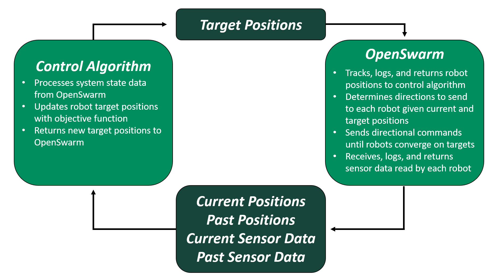

# OpenSwarm Documentation: Software

## Design

OpenSwarm is meant to serve as a research _tool_ invoked in the study of swarm control algorithms. As such, the software behind OpenSwarm is built to interface with prototypical control algorithms by returning

- current robot positions in testbed _(x,y)t_
- past robot positions in testbed _(x,y)t-k_ (for _k=1,2,..._)
- current robot sensor data (e.g., light levels from an LDR) _st_
- past robot sensor data _st-k_ (for _k=1,2,..._)

to the control algorithm in exchange for 

- a dictionary of specified target positions for each robot to converge upon

as input which the OpenSwarm software will direct the robots towards.

This design puts responsibility on the control algorithm under test to

- process current and past robot positional data
- process current and past robot sensor data
- determine target positions of each robot with some objective function, and
- return the set of target positions for each robot as a dictionary

while handling the logistics of 

- tracking each robot's position given an overhead image of the testbed
- determining navigational directions for each robot given its current and target position
- sending navigational directions to each robot
- receiving and returning robot sensor data
- logging past robot position and sensor data

on behalf of the system.

Hence, OpenSwarm provides a robust, modular, and configureable interface for managing a swarm of robots given an algorithm which processes system state against an objective function to determine (in discrete iterations) where the swarm should go next.

The software follows a client-server architecture model, where each robot in the testbed acts as a client (powered by Arduino) and one central computer with an overhead webcam view of the testbed acts as a server (powered by Matlab). Each client robot listens for commands from the server, and replies with sensor readouts upon reception of a command before executing the command.

### Server-Side Design

The OpenSwarm server is responsible for 

- interfacing with the control algorithm to receive and set target positions
- processing live-feed image data to determine current robot positions
- determining directional commands to achieve convergence on target positions
- sending commands to the robots via UDP broadcast
- listening for sensor data returned from the robots via UDP broadcast, and 
- returning positional and sensor data to the control algorithm for processing 

in discrete-time iterations.

Implemented in Matlab, it makes use of the language's dynamically-typed, debugging-friendly nature and leverages the extensive built-in image-processing, mathematical computing, plotting, and networking libraries to deliver a user-friendly experience.

Matlab can be downloaded for free with an academic license [here](https://www.mathworks.com/products/matlab.html); alternatively, GNU Octave can be downloaded under a GNU General Public License for free [here.](https://www.gnu.org/software/octave/)

### Client-Side Design

The OpenSwarm clients (robots) are responsible for

- listening for commands from the server via UDP broadcast
- parsing received commands to determine what action should be taken
- executing the action (turning a given number of degrees and driving forward for a certain amount of time) prescribed by the server
- reading and returning sensor values to the server via UDP broadcast

in discrete-time iterations.

Implemented in Arduino (C/C++), the client code is lightweight and assumes complex operations will be carried out by the server. In this sense, it hard-codes the prerequisite of _swarm intelligence_ into each agent: invidual simplicity.

The official Arduino IDE can be downloaded for free under a Creative Commons Attribution Share-Alike License [here](https://www.arduino.cc/en/Main/Software); alternatively, many popular text editors provide plugins to support Arduino and C/C++ development (Visual Studio Code plugin [here](https://marketplace.visualstudio.com/items?itemName=vsciot-vscode.vscode-arduino)).

## Architecture

### Server-Side

All server-side code can be found in the [Matlab](../Matlab/) folder.

Within the [Matlab](../Matlab/) folder, control programs can be found in the [Controllers](../Matlab/Controllers/) subfolder, and rely on helper classes and input data in the 

- [Actors](../Matlab/Actors/)
- [Models](../Matlab/Models/)
- [Utils](../Matlab/Utils/) 
- [Data](../Matlab/Data/)

subfolders to fulfill the responsibilities defined in the Design section above. 

A more complete breakdown and description of each of these folders and their contents is provided below.

#### [Controllers](../Matlab/Controllers/)

Contains main high-level control programs.

| Class | Purpose |
|-|-|
| [`Pathfinder.m`](../Matlab/Controllers/Pathfinder.m) | Read sequence of _m_ target waypoints for each of _n_ robots from CSV file. For each set of _n_ out of _m*n_ waypoints, iteratively locate the _n_ robots, then generate and send directions until all _n_ robots converge on the current set of _n_ waypoints. Then, advance to the next set of _n_ waypoints and repeat until all robots converge. Continue until all _m*n_ waypoints are exhausted. |

#### [Actors](../Matlab/Actors/)

Contains essential (active) helper classes.

| Class | Purpose |
|-|-|
| [`Messenger.m`](../Matlab/Actors/Messenger.m) | abcd |
| [`Navigator.m`](../Matlab/Actors/Navigator.m) | abcd |
| [`Plotter.m`](../Matlab/Actors/Plotter.m) | abcd |
| [`Vision.m`](../Matlab/Actors/Vision.m) | abcd |

#### [Models](../Matlab/Models/)

Contains classes for data storage.

| Class | Purpose |
|-|-|
| [`Burst.m`](../Matlab/Models/Burst.m) | abcd |
| [`Environment.m`](../Matlab/Models/Environment.m) | abcd |
| [`Point.m`](../Matlab/Models/Point.m) | abcd |
| [`Position.m`](../Matlab/Models/Position.m) | abcd |

#### [Utils](../Matlab/Utils/)

Contains auxiliary helper functionalities.

| Class | Purpose |
|-|-|
| [`Utils.m`](../Matlab/Utils/Utils.m) | abcd |

#### [Data](../Matlab/Data/)

Contains static data used as input in control programs.

| Class | Purpose |
|-|-|
| [`circle.csv`](../Matlab/Data/circle.csv) | Demo input data for [`Pathfinder.m`](../Matlab/Controllers/Pathfinder.m) which directs three robots in a circle around the testbed. |

### Client-Side

All client-side code can be found in the [Arduino](../Arduino/) folder.

Within the [Arduino](../Arduino/) folder, [`Pathfinder.ino`](../Arduino/src/Pathfinder.ino) serves as the main client-side control program, and relies on the helper classes

- [`Configuration.h`](../Arduino/src/include/Configuration.h)
- [`Driver.h`](../Arduino/src/include/Driver.h)
- [`Parser.h`](../Arduino/src/include/Parser.h)
- [`Utilities.h`](../Arduino/src/include/Utilities.h)

defined in the [Arduino/src/include](../Arduino/src/include/) subfolder to fulfill the responsibilities defined in the Design section above.

It leverages the

- [avr](../Arduino/Libraries/avr/)
- [MMEmotor](../Arduino/Libraries/MMEmotor/)
- [util](../Arduino/Libraries/util/)
- [WiFiEsp-master](../Arduino/Libraries/WiFiEsp-master)

libraries included in the [Arduino/Libraries](../Arduino/Libraries/) subfolder to simplify tasks involving communications, networking, and motor control.

A more complete description of the purpose of each class is included below:

| Class | Purpose |
|-|-|
| [`Pathfinder.ino`](../Arduino/src/Pathfinder.ino) | Control robot trajectory by receiving, parsing, and executing commands broadcast over UDP by server. Read and transmit sensor data back to server via UDP broadcast. |
| [`Configuration.h`](../Arduino/src/include/Configuration.h) | Store global constants used in [`Pathfinder.ino`](../Arduino/src/Pathfinder.ino) and other helper classes. |
| [`Driver.h`](../Arduino/src/include/Driver.h) | Encapsulate specifics of motor control and support simple calls to move robot. |
| [`Parser.h`](../Arduino/src/include/Parser.h) | Encapsulate UDP message parsing and support simple interfacing with server. |
| [`Utilities.h`](../Arduino/src/include/Utilities.h) | Encapsulate hardware interfacing and provide auxiliary helper methods. 

<a href=03-Hardware.md>Previous: Hardware</a>

<a href=05-Demos.md>Next: Demos</a>
