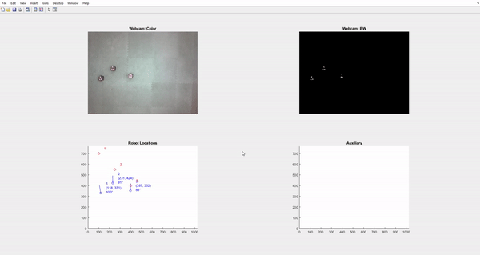

# OpenSwarm Documentation: Demos

## Pathfinder

### Overview

[`Pathfinder.m`](../Matlab/Controllers/Pathfinder.m) directs a swarm of robots to follow individual paths within the testbed from waypoint to waypoint, iteratively awaiting the swarm's convergence on each set of waypoints before advancing to the next set of waypoints. It demonstrates the key fundamentals underlying OpenSwarm, leveraging the `Actor` classes [`Vision.m`](../Matlab/Actors/Vision.m), [`Navigator.m`](../Matlab/Actors/Navigator.m), [`Messenger.m`](../Matlab/Actors/Messenger.m), and [`Plotter.m`](../Matlab/Actors/Plotter.m) along with the `Model` classes [`Environment.m`](../Matlab/Models/Environment.m), [`Point.m`](../Matlab/Models/Point.m), [`Position.m`](../Matlab/Models/Position.m) and [`Burst.m`](../Matlab/Models/Burst.m) to track and guide robots in the field.

As currently configured, [`Pathfinder.m`](../Matlab/Controllers/Pathfinder.m) reads the sequence of waypoints which determine each robot's path from a CSV file, allowing one to conduct repeatable experiments on a predetermined path.

With slight modification, however, the code of [`Pathfinder.m`](../Matlab/Controllers/Pathfinder.m) could easily be utilized to generate and/or update such waypoints during run-time, opening the door to adaptive control algorithms responsive to the real-time state of the swarm. As such, [`Pathfinder.m`](../Matlab/Controllers/Pathfinder.m) provides a wonderful encapsulation of what's possible with OpenSwarm.

Note that the [`Vision.m`](../Matlab/Actors/Vision.m) class is responsible for all webcam image processing and positional tracking of the robots, and that

1. Robots are assigned IDs 1, 2, 3, ..., n based on their distance from the origin of the testbed in the first image frame processed by `Vision.m`, and
2. Robot IDs are reassigned from frame to frame by a between-frame nearest-neighbor search (such that [`Vision.m`](../Matlab/Actors/Vision.m) inductively "knows" which robot is which in any given frame by comparing it to the last frame, and makes the above assumption to assign IDs on the first frame).

Without diving too deeply into the implementation details of [`Vision.m`](../Matlab/Actors/Vision.m), this means that in order for [`Pathfinder.m`](../Matlab/Controllers/Pathfinder.m) (and, by extension, any program leveraging [`Vision.m`](../Matlab/Actors/Vision.m)) to properly function:

1. Robot with `ID = 1` flashed to its [`Configuration.h`](../Arduino/src/include/Configuration.h) file should be nearest the testbed origin before running the script,
2. Robot with `ID = 2` flashed to its [`Configuration.h`](../Arduino/src/include/Configuration.h) file should be 2nd nearest the testbed origin before running the script, etc...

An easy way to achieve such a valid starting position is to simply order the robots by ID along the bottom x-axis of the testbed prior to running the script. See the video below for an example.

### Pseudocode

        initialize dependencies
        read targets from csv

        for i in (1, number of targets in sequence) do:

            while (swarm is not converged on this target set) do:
                take webcam photo and update robot positions
                compare positions to targets and generate directions
                send directions to swarm
                wait for swarm to execute directions
            end while

            update targets to next set in sequence

        end for

### [Video](https://drive.google.com/file/d/1sg5UwmmTrKHravdvXssg3EsE5B3mb11p/preview)

Example run of [`Pathfinder.m`](../Matlab/Controllers/Pathfinder.m) with [`circle.csv`](../Matlab/Data/circle.csv) as path input:

<a href=04-Software.md>Previous: Software</a>

<a href=A1-Troubleshooting.md>Next: Troubleshooting</a>
